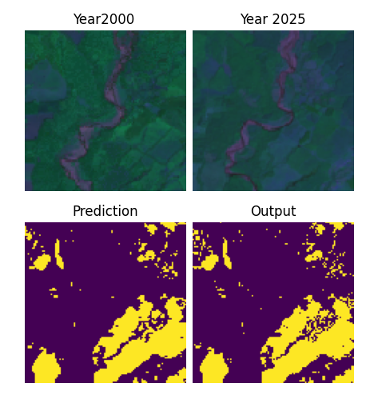
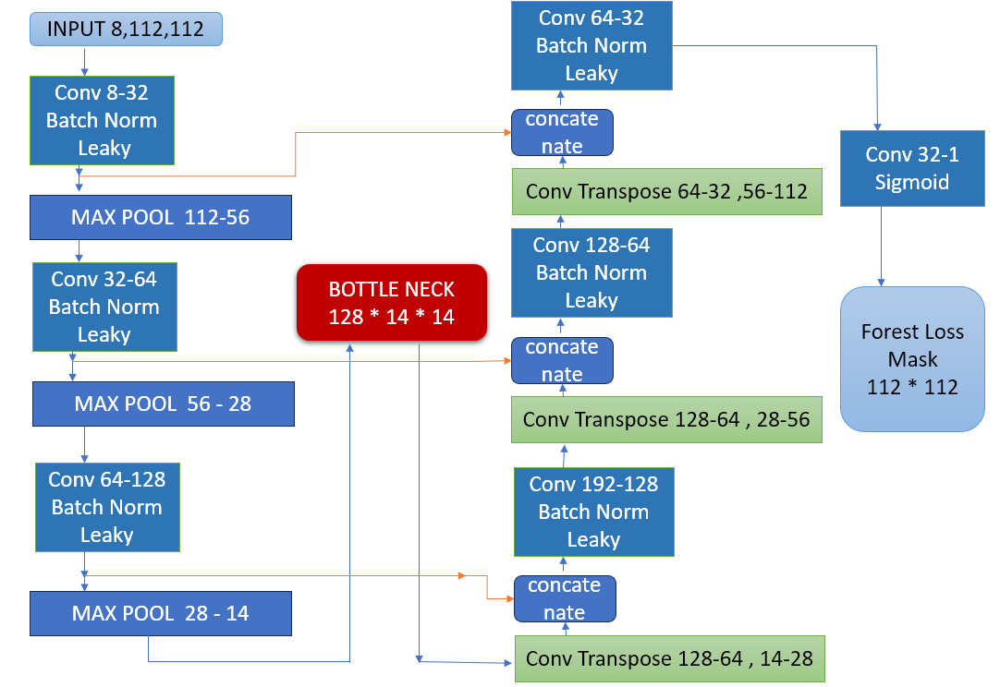

# ForestChangeNet 

### Multi-Temporal Satellite Image Segmentation for Forest Loss Detection

This is a deep-learning based computer vision project that uses
multi-temporal satellite imagery to detect areas of forest loss.

The project uses spectral information from approximately the beginning(around year 2000) and
end (around year 2025) of the observation period and trains a U-Net based segmentation model to
produce a pixel-level forest-loss mask.

The project is built using Python, PyTorch, Google Earth Engine, and the
Hansen Global Forest Change dataset.

---

## Overview

Deforestation and forest degradation can significantly change the landscape
over time. Satellite imagery provides a way to monitor these changes over
large geographic regions.

In this project, satellite observations from two different periods year 2000 as basline and year 2025 are used
as input to a convolutional neural network.

The model receives:

- 4 spectral bands from the earlier observation
- 4 spectral bands from the later observation

for a total of **8 input channels**.

The model then predicts a binary mask indicating whether forest loss has
occurred at each pixel.   

    
---
### Objective

The primary objective of this project is to develop a neural-network based
approach for detecting forest loss from multi-temporal satellite imagery.

More specifically, the project attempts to learn the relationship between
spectral information observed at different points in time and the spatial
distribution of forest loss.

The final goal is to produce a pixel-level prediction mask that can be
visualized over the original satellite imagery.
---
### Network Architecture

---
### Input

```text
Earlier observation (around year 2000)
├── first_b30 (Red): Measures red light wavelengths (~0.63–0.69 µm). Useful for detecting chlorophyll absorption in healthy vegetation and bare soil contrast.
├── first_b40 (Near Infrared / NIR): Measures near-infrared light (~0.77–0.90 µm). Highly reflective for healthy vegetation (plant leaves heavily scatter NIR). When trees are cut down, NIR drops drastically.
├── first_b50 (Short-Wave Infrared 1 / SWIR1): Measures short-wave infrared (~1.55–1.75 µm). Sensitive to moisture content in vegetation and soils.
└── first_b70 (Short-Wave Infrared 2 / SWIR2): Measures longer SWIR wavelengths (~2.08–2.35 µm). Excellent for distinguishing between soil types, rock types, and burned or cleared areas.


Later observation (around year 2025)
├── b30 (Red): Measures red light wavelengths (~0.63–0.69 µm). Useful for detecting chlorophyll absorption in healthy vegetation and bare soil contrast.
├── b40 (Near Infrared / NIR): Measures near-infrared light (~0.77–0.90 µm). Highly reflective for healthy vegetation (plant leaves heavily scatter NIR). When trees are cut down, NIR drops drastically.
├── b50 (Short-Wave Infrared 1 / SWIR1): Measures short-wave infrared (~1.55–1.75 µm). Sensitive to moisture content in vegetation and soils.
└── b70 (Short-Wave Infrared 2 / SWIR2): Measures longer SWIR wavelengths (~2.08–2.35 µm). Excellent for distinguishing between soil types, rock types, and burned or cleared areas.
```

---
### Dataset

The project uses the:

Hansen Global Forest Change 2025 v1.13
dataset available through Google Earth Engine.  
Dataset:
The dataset provides historical forest-change information together with
Landsat-derived spectral imagery.

---
### Data Preparation

Google Earth Engine is used to select geographic regions and export the
required satellite data.

For each selected region:

Define the geographic Area of Interest (AOI).  
Load the Hansen Global Forest Change dataset.   
Select the eight input bands.   
Select the lossyear target band.   
Combine the input and target bands.   
Clip the dataset to the selected AOI.  
Export the resulting data as a GeoTIFF.  
Read the GeoTIFF using rasterio.  
Divide the image into smaller training patches.  

The data preparation script exports the eight input bands together with the
target band into a single GeoTIFF for each selected region.

---
### Geographic Regions

The current data preparation script contains several manually selected
geographic regions across different areas.

These include regions in:

Jammu & Kashmir  
Pakistan  
Uttarakhand  
Chhattisgarh  
Odisha  
Andhra Pradesh

The project can be extended by adding additional geographic regions to the
data preparation pipeline.

---
### Patch Generation

Large satellite images are divided into smaller patches before being passed
to the neural network.  

Current configuration:

Patch size: 112 × 112
Stride:     20 pixels

Each generated patch contains:

112 × 112 × 8

input data and:

112 × 112 × 1

target information.

The relatively small patches allow the model to process large satellite
regions using manageable inputs.

---
### Loss Function

The current implementation uses Binary Cross Entropy loss:

torch.nn.BCELoss()

because the task is binary segmentation:

0 → No loss  
1 → Forest loss

The model uses a sigmoid activation at the output to produce values between
0 and 1.

---
### IoU Metric

Intersection over Union (IoU) is used to evaluate the predicted forest-loss
segmentation.

IoU is calculated as:

IoU = Union / Intersection

where:

Intersection = predicted loss ∩ actual loss
Union = predicted loss ∪ actual loss

### Prediction and Visualization

`predict.py` is used to load a trained model checkpoint and visualize its
predictions on randomly selected satellite-image patches.

For each selected patch, the script displays:

1. Earlier satellite observation
2. Later satellite observation
3. Predicted forest-loss mask
4. Ground-truth forest-loss mask

The script also calculates the IoU for the selected prediction, allowing
visual comparison between the model output and the target mask.

### Results

Training is currently ongoing on a dataset of **42,012 image patches**.

The current training configuration is:

- **Model:** U-Net
- **Input:** 8-channel multi-temporal satellite imagery
- **Patch size:** 112 × 112
- **Optimizer:** Adam
- **Learning rate:** 1e-4
- **Batch size:** 300
- **Loss:** Binary Cross-Entropy (BCE)
- **Evaluation metric:** Intersection over Union (IoU)

### Current Training Performance

After approximately **3,840 training epochs**, the model has reached:

| Metric | Current Result |
|---|---:|
| Training Loss | ~0.086 |
| Training IoU | ~45.8% |
| Dataset Size | 42,012 patches |
| Best observed Training IoU | **45.83%** |

The training IoU around epochs 3783–3840 remained relatively stable in the **44.5–45.8%** range, indicating that the model has reached a plateau under the current training configuration.

A temporary decrease was observed around epoch 3796, where the IoU dropped to approximately 30.0%. The model recovered in subsequent epochs, suggesting that this was a temporary training fluctuation rather than a persistent degradation.

### Interpretation

The current dataset includes patches across a much broader range of forest-loss densities than the earlier training setup. This makes the segmentation task more challenging while providing a more representative training distribution.

The current ~45.8% IoU is therefore treated as a **training baseline rather than a final performance result**.

Further experiments are planned to investigate whether the segmentation performance can be improved through:

- BCE + Dice loss
- Reduced batch sizes
- Learning-rate scheduling
- Lower learning rates during later training
- Adam vs. SGD with momentum
- Improved handling of sparse forest-loss regions
- Validation and test-set evaluation

> **Note:** The reported IoU is training IoU. Validation/test performance has not yet been reported and will be added as the evaluation pipeline is developed.
---
### Technologies Used
Python  
Deep Learning  
PyTorch  
Torchvision  
Geospatial / Remote Sensing  
Google Earth Engine  
Hansen Global Forest Change  
Rasterio  
GeoTIFF  
Data Processing  
NumPy  
Visualization  
Matplotlib  
Development  
Git  
GitHub  

---

            